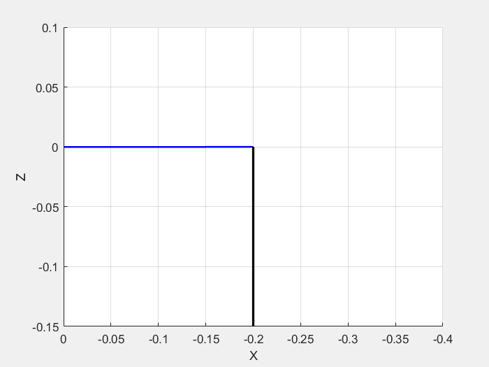
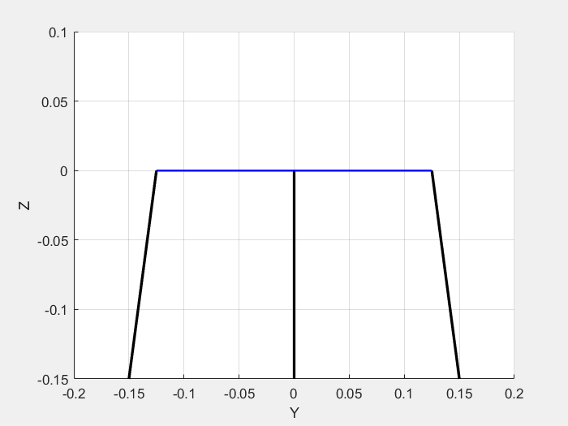

# Thrus_Vector_Control_IK_FK

Inverse Kinematics and Forward Kinematics Simulation

Purpose: To change the direction of thrust in the coaxial rotorcraft

S 2 SPS and SPR Parallel manipulator

Pitch Only Test

Roll Only Test

The number of actuators = 2 linear actuators

The plate moves in a conical way.

The conical motion would take 3 degree of freedom(Roll, Pitch and Yaw) if the manipulator consists of S 2SPS except SPR.

However, the number of actuator is less than the number of DOF that have to be controlled.

Hence, it is necessary to include one more joint (SPR) to make the mechanism have 2 DOF.

Check Simulation.

Pitch and Roll - RPS joint prevent the platform from taking yaw motion( = moving side to side).

