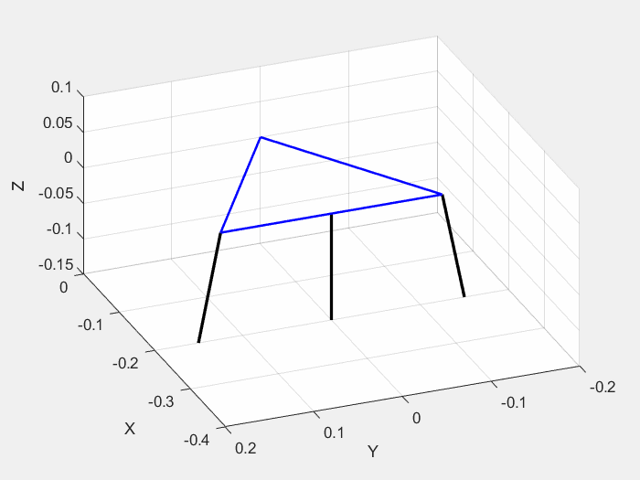
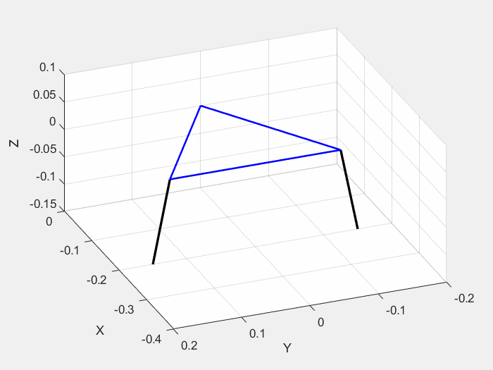

# Thrus_Vector_Control_IK_FK

Inverse Kinematics and Forward Kinematics Simulation

Purpose: To change the direction of thrust in the coaxial rotorcraft

S 2 SPS and SPR Parallel manipulator

Pitch Only Test

Roll Only Test

Pitch and Roll - RPS joint prevent the platform from moving from side to side.

